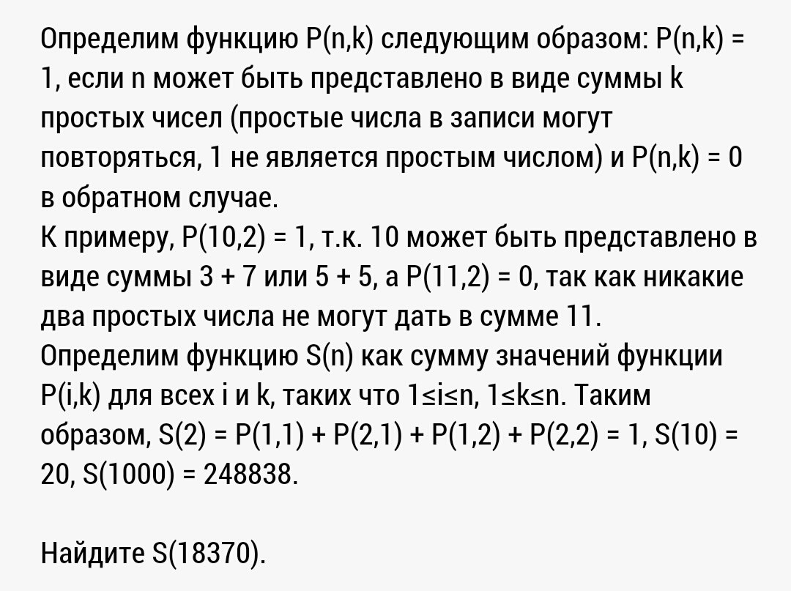

# Money and prime numbers
=================

Simple exercise:



## Source structure

* `src/money` contains whole the implementation;
* `src/test` contains Google C++ Testing Framework tests.

## Build

Use CMake:

```
> mkdir build
> cd build
> cmake ..
> make -j8
> 
...
```

## Tests

For testing purposes this project uses Google C++ Testing Framework. To enable tests you should define `ENABLE_TESTS=ON` variable:

```
> cmake -DENABLE_TESTS=ON ..
> make -j8
> ./money_test
...
```
